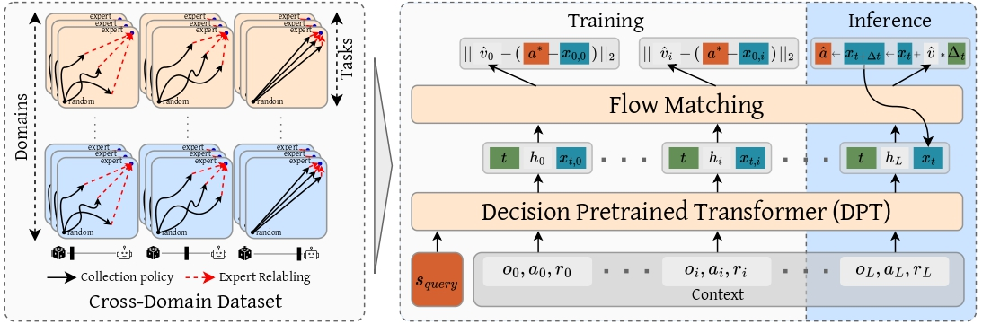
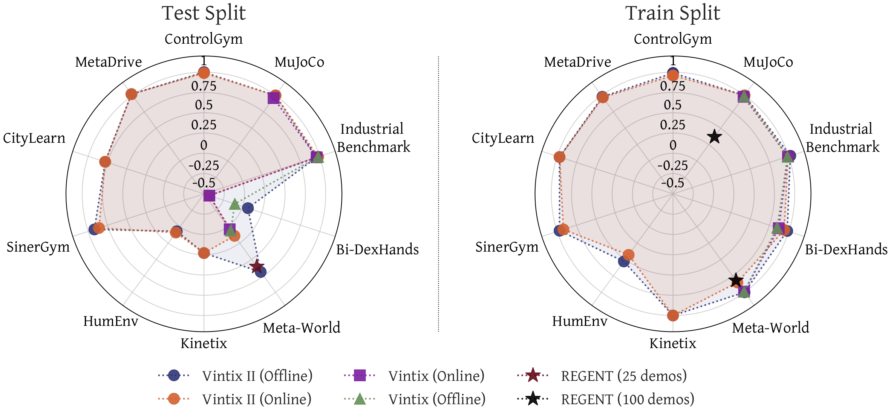

<!-- <p align="center" width="100%">

</p> -->

# Vintix II: Decision Pre-Trained Transformer is a Scalable In-Context Reinforcement Learner
<!-- [](https://arxiv.org/abs/2501.19400) -->
[](https://huggingface.co/dunnolab/VintixII)
[](https://huggingface.co/datasets/artfawl/VintixDatasetII)
[](LICENSE)


## The list of contents
1. [Highlights](#highlights)
2. [Load Training Data](#load-training-data)
3. [Training](#training)
4. [Inference](#inference)
5. [Citation](#citation)

## Highlights
<p align="center" width="80%">

</p>

1. Improved test-time performance on unseen tasks relative to prior Large Action Models;
2. Collected a large cross-domain dataset containing over 700M transitions across 209 training tasks spanning 10 domains;
3. Scaled [DPT](https://arxiv.org/abs/2306.14892) to the cross-domain setting;


## Load Training Data
The Vintix II training dataset is freely available to everyone under the CC BY-SA 4.0 License. The recommended way to download it is from Hugging Face at [VintixDatasetII](https://huggingface.co/datasets/artfawl/VintixDatasetII):
```shell
pip3 install huggingface_hub
```
```python
from huggingface_hub import snapshot_download

snapshot_download(repo_id="artfawl/VintixDatasetII",
                  repo_type="dataset",
                  local_dir="/path/to/VintixDatasetII")
```

Alternatively, you can download the dataset from the public S3 bucket using the curl utility (or alternatives like wget). Be sure to unzip the downloaded file before use.
```shell
curl -L -o VintixII.zip https://tinyurl.com/VintixDataset2

unzip VintixII.zip
```

### Dataset Structure

The dataset consists of multiple .h5 files, each corresponding to a single trajectory in a specific environment. Each file is divided into groups of 10,000 steps (the last group in a trajectory may contain fewer). These groups contain the following keys:
- `proprio_observation`: The sequence of observations (`np.float32`)
- `action`: The sequence of actions taken in the environment (`np.float32`)
- `reward`: The sequence of rewards received after each action (`np.float32`)
- `step_num`: The sequence of step numbers within each episode (`np.int32`)
- `demonstrator_action`: The sequence of demonstrator actions for current observation (`np.float32`)

For more details on the collected trajectories, please refer to our [work](https://arxiv.org/abs/2501.19400).

## Training
1. Clone this repository
  ```shell
  git clone https://github.com/dunnolab/vintix-II.git
  ```
2. Prepare the Python environment following [these](train/docker/README.md) instructions
3. Run the following commands from repo directory:
  ```shell
  export WORLD_SIZE=$(nvidia-smi -L | wc -l)

  OMP_NUM_THREADS=1 torchrun \
    --standalone \
    --nnodes=1 \
    --nproc-per-node=$WORLD_SIZE \
    --module train.train \
    --config_path train/configs/train_config.yaml \
    --data_dir path/to/dataset/folder \
    --save_dir path/to/checkpoints/dir
  ```

## Inference
The trickiest part of inference is setting up the Python environment for the chosen domain. Each domain has its own structure and dependencies, and many are incompatible with one another. To simplify setup, we provide a Docker image for each domain—see the instructions in the [domains](domains) directory.

Each image includes the `domain` package, which provides helper functions:

* `get_env_names()` — lists the available environment names for the selected domain.
* `get_env()` — instantiates and returns the specified environment.

Use these utilities to create the environment you need for inference.


To get started with our model, follow the next steps:
1. Clone this repository
  ```shell
  git clone https://github.com/dunnolab/vintix-II.git
  ```
2. Choose a [domain](domains) to infer on and follow the instructions on preparing the Python environment
3. Install VintixII
  ```shell
  cd vintix-II
  pip3 install -e .
  ```
4. Download checkpoint from [huggingface](https://huggingface.co/dunnolab/VintixII)
 ```shell
 pip3 install huggingface_hub
 ```
 ```python
 from huggingface_hub import snapshot_download

 snapshot_download(repo_id="dunnolab/VintixII",
                   local_dir="/path/to/checkpoint")
 ```
5. Enjoy VintixII. You can find a simple usage example below or more examples [here](inference)

```python
import torch
from domain.environments import get_env_names, get_env
from vintix import Vintix2


PATH_TO_CHECKPOINT = "/path/to/checkpoint"
model = Vintix2()
model.load_model(PATH_TO_CHECKPOINT)
model.to(torch.device('cuda'))
model.eval()

task_names = get_env_names()
task_name = task_names[0]
print(f"Current task is {task_name}")
env = get_env(task_name)
model.reset_context(task_name,
                    torch_dtype=torch.float16)
max_env_steps = 50

episode_rewards = []
for step in range(max_env_steps):
    cur_ep_rews = []
    observation, info = env.reset()
    reward = None
    done = False
    while not done:
        action = model.get_next_action(observation=observation,
                                       prev_reward=reward)
        observation, reward, termined, truncated, info = env.step(action)

        done = termined or truncated
        cur_ep_rews.append(reward)
    episode_rewards.append(sum(cur_ep_rews))
print(f"Rewards per episode for {task_name}: {episode_rewards}")
```


## Citation
<!-- If you would like to cite our work, please use the following bibtex

```bibex
@article{polubarov2025vintix,
  author={Andrey Polubarov and Nikita Lyubaykin and Alexander Derevyagin and Ilya Zisman and Denis Tarasov and Alexander Nikulin and Vladislav Kurenkov},
  title={Vintix: Action Model via In-Context Reinforcement Learning},
  journal={arXiv},
  volume={2501.19400},
  year={2025}
}
``` -->
